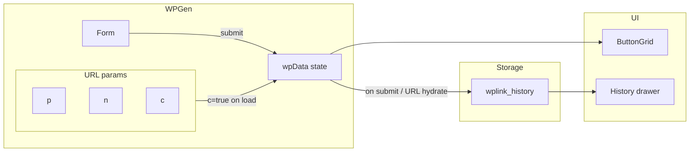

# WP-Gen core logic and generalized storage

## 1. Generalized storage hook (any type: string, boolean, object, array, nested)

**Approach:** Use **nanostores** + **@nanostores/persistent** + **@nanostores/react** so that:

- Same key stays in sync across components and browser tabs.
- One generic API for get/set/delete any JSON-serializable type.

**New files:**

- `[src/lib/storage/createPersistentStore.ts](src/lib/storage/createPersistentStore.ts)` – Factory: `createPersistentStore<T>(key, initial)` returns a persistent atom (from `@nanostores/persistent`) that syncs to `localStorage`. Use JSON for (de)serialization so it supports string, number, boolean, plain objects, arrays, and nested structures.
- `[src/hooks/useStorage.ts](src/hooks/useStorage.ts)` – Hook: `useStorage<T>(key, options?: { default?: T })` returns `[value, setValue, remove]`. Under the hood: get or create store via a small registry (Map of key → atom), then `useStore(store)` from `@nanostores/react` and expose `store.set` / delete by setting to `undefined` or a dedicated `remove(key)` that clears localStorage and sets store to initial.

**Design details:**

- **Keys:** Single namespace (e.g. `localStorage.getItem(key)`). No type in key; type is in the generic `T`.
- **Serialization:** `JSON.stringify` / `JSON.parse` for non-string primitives and objects. For string, can store as-is or still JSON to keep one code path.
- **Delete:** Either `set(undefined)` and have the persistent store remove the key, or a separate `remove(key)` that clears storage and resets the in-memory store to `default`.
- **Registry:** In `createPersistentStore`, keep a global `Map<string, WritableAtom>` so multiple calls with the same key return the same store (single source of truth).

**Dependencies:** Add `nanostores`, `@nanostores/react`, `@nanostores/persistent`.

---

## 2. WP link and contact helpers

**New file:** `[src/lib/utils/wp-gen.ts](src/lib/utils/wp-gen.ts)`

- `phoneToDigits(phone: string): string` — digits only (for equality / deduplication).
- `preferPhoneWithDialCode(phoneA: string, phoneB: string): string` — returns the phone string that has dial code (leading `+` or known dial prefix); use for choosing which form to store in history.
- `buildWhatsAppLink(phone: string): string`  
  Strip to digits only (reuse or mirror [numberUtils](src/lib/utils/numberUtils.ts): strip `+`, spaces, dashes; no leading zeros). Format: `https://wa.me/<digits>` (WhatsApp expects digits only, no `+`).
- `**buildGoogleContactsLink(phone: string, name?: string): string`  
  `https://contacts.google.com/new?` + `URLSearchParams({ phone: normalized phone with + if needed, name: name || "" })`. Phone in E.164-like form (e.g. `+8801234567890`).
- `**buildVCard(name: string | undefined, phone: string, createdAt: Date): string`  
  vCard 3.0 string: FN, N, TEL (with dial code), and use `REV` or a custom field for "date created" as the event date (e.g. `REV:YYYYMMDD` or similar).
- `**downloadVCard(vcard: string, filenameBase: string): void`  
  Create blob, object URL, `<a download>`, trigger click, revoke URL. Filename e.g. `contact-{filenameBase}.vcf`.

Use existing [matchDialCodeFromPhone](src/lib/utils/numberUtils.ts) / sanitized phone where needed so the phone passed to these helpers is already in a consistent form (e.g. with `+` for display/E.164).

---

## 3. WPGen form: generate link, set state, persist history, hydrate from URL

**File:** [src/components/wp-gen/wp-gen.tsx](src/components/wp-gen/wp-gen.tsx)

- **On submit (handleSubmit):**
  - If no phone, return.
  - Build `wpLink = buildWhatsAppLink(phone)` (digits-only from current `phone`).
  - Build `wpData = { phone, wpLink, name: name || undefined }`.
  - `setWpData(wpData)`.
  - `setCompleted(true)` (already done).
  - **History upsert (no duplicates):** read current history, then apply upsert logic (§6): same number moves to top and name updates if different; prefer storing phone with dial code.
- **On load (useEffect):**
  - Only when `completed === true` (i.e. URL has `c=true`) and we have `phone` (URL param `p`): build `wpData`, `setWpData(wpData)`, and run the **same history upsert** (no duplicate, move to top, prefer dial-code form, update name).
- **State:** Keep `wpData` in React state for the current card; history is in storage only (read when opening History drawer).

---

## 4. ButtonGrid: Google Contact href, vCard download

**File:** [src/components/wp-gen/button-grid.tsx](src/components/wp-gen/button-grid.tsx)

- **Google Contact link:** Set `href={buildGoogleContactsLink(wpData.phone, wpData.name)}` (and `href=""` when disabled or no wpData).
- **Save on phone (vCard):** On button click: build vCard with `buildVCard(wpData.name, wpData.phone, new Date())`, then `downloadVCard(vcard, wpData.phone.replace(/\D/g, "").slice(-8))` (or similar safe filename). Disabled when `!wpData` or `disabled`.

---

## 5. History: load from storage, show list

**File:** [src/components/wp-gen/history.tsx](src/components/wp-gen/history.tsx)

- Use the new storage hook with key `wplink_history` and default `[]`.
- Type: array of `StoredWpData` (wpData & { createdAt?: string }).
- Replace `sampleHistory` with this stored array; render `HistoryCard` for each item (key by e.g. `phone + createdAt` or index).
- Pass an **onDelete** callback to each `HistoryCard`: when called, remove that entry from the array (filter by digits match or index), then save back to storage.

**File:** [src/components/wp-gen/history-card.tsx](src/components/wp-gen/history-card.tsx)

- Keep existing props (phone, wpLink, name). Add **icon button** (e.g. Trash from lucide-react) to delete that entry.
- Add prop `onDelete?: () => void`. Delete button calls `onDelete` on click; use `e.stopPropagation()` so the card link does not fire.
- Style as icon-only, destructive or muted. Parent (History) passes `onDelete` that removes this entry from stored history and updates storage.

---

## 6. History storage shape, cap, and deduplication

- **Key:** `wplink_history`
- **Value:** `Array<StoredWpData>` where `StoredWpData = wpData & { createdAt?: string }` (newest first).
- **Cap:** e.g. 10 entries.

**Deduplication and upsert rules:**

- **Same number = one entry.** Compare by **digits only** (strip all non-digits from both sides) so `+8801234567890`, `8801234567890`, and `0171234567890` (if 017 is national prefix for BD) are treated as the same. Add a helper e.g. `phoneToDigits(phone: string): string` in `wp-gen.ts` or numberUtils and use it for equality.
- **If an entry with the same digits exists:** do not add a new row. Instead: (1) remove the existing entry from the array, (2) build the **single** updated entry (see "prefer dial code" below), (3) prepend it so it becomes the newest (top), (4) optionally refresh `createdAt` to now. If the new input has a **different name**, use the new name for that entry; otherwise keep the existing name if the new name is empty.
- **Prefer phone with dial code in storage:** When merging (same number), keep the **phone string that includes the country dial code** (e.g. `+8801234567890`) over the one that doesn't (e.g. `0171234567890` or `1234567890`). So: if the existing entry's phone has a leading `+` (or matches a known dial code pattern) and the new one doesn't, keep existing phone; if the new one has dial code and existing doesn't, use new phone; if both have or both don't, prefer the one with `+`. Implement with a small helper e.g. `preferPhoneWithDialCode(phoneA, phoneB): string` that returns the "better" form.
- **Add:** Only when no entry with same digits exists: prepend new entry, then `.slice(0, 10)` and save.

---

## 7. Optional: extend wpData for "date created"

If we want vCard "event date" to reflect when the contact was first created (e.g. when loaded from history), we can add optional `createdAt?: string` to the **stored** history entry type only (not necessarily to [wpData](src/types/wpData.ts)). When building vCard from ButtonGrid for the _current_ generation, use `new Date()`. When building from a history card (if we add that later), use `createdAt`. So no type change to the public `wpData` type is required for the current scope.

---

## 8. Data flow summary

---

## 9. Implementation order

1. Add deps: `nanostores`, `@nanostores/react`, `@nanostores/persistent`.
2. Implement `createPersistentStore` + `useStorage` (generic).
3. Implement `wp-gen.ts` (buildWhatsAppLink, buildGoogleContactsLink, buildVCard, downloadVCard).
4. WPGen: handleSubmit → build wpData, set state, **history upsert** (§6); useEffect → when c=true and p present, build wpData, set state, same history upsert.
5. ButtonGrid: wire Google Contact href and vCard button.
6. History: read from `wplink_history` via useStorage, render list, pass onDelete; remove sampleHistory import. HistoryCard: add delete icon button and onDelete prop.

---

## 10. Files to add/change (summary)

| Action | File                                                                                 |
| ------ | ------------------------------------------------------------------------------------ |
| Add    | `src/lib/storage/createPersistentStore.ts`                                           |
| Add    | `src/hooks/useStorage.ts`                                                            |
| Add    | `src/lib/utils/wp-gen.ts`                                                            |
| Edit   | `src/components/wp-gen/wp-gen.tsx` (submit + URL hydrate + history write)            |
| Edit   | `src/components/wp-gen/button-grid.tsx` (Google link + vCard download)               |
| Edit   | `src/components/wp-gen/history.tsx` (use storage, drop sampleHistory, pass onDelete) |
| Edit   | `src/components/wp-gen/history-card.tsx` (add delete icon button + onDelete prop)    |
| Edit   | `package.json` (nanostores, @nanostores/react, @nanostores/persistent)               |

No change to [wpData](src/types/wpData.ts) type. Use `StoredWpData = wpData & { createdAt?: string }` only in storage/history code.
